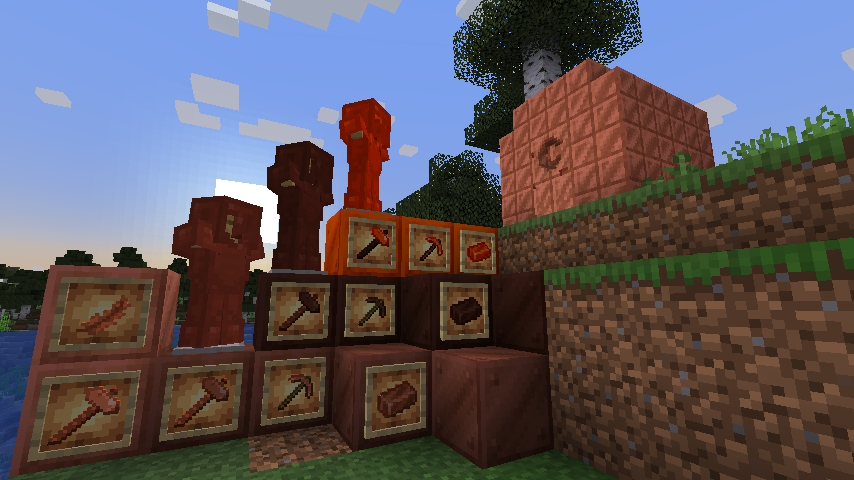
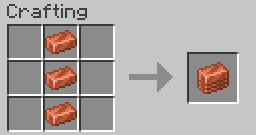
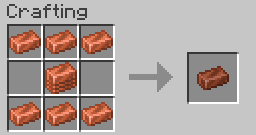

# CrappingCopper

A minecraft mod to allow usages for copper beyond the 3 base recipes in 1.18. Check out the curseforge page: https://www.curseforge.com/minecraft/mc-mods/crapping-copper

Ever notice that you can't really use copper for much? This mod tries to alleviate the problem by giving copper more purpose!

This mod adds:
* 3 tiers of copper.
* 4 tiers of copper hammers.
* 3 different copper blocks & a door.
* Copper feathers to make arrows

To get started, get nine pieces of copper together. Due to the fact that copper blocks exist, you have to craft a stack first:

Then you can craft a compressed copper ingot like so:

Which you can use for many other items. I won't spoil all the recipes on this github page though!
